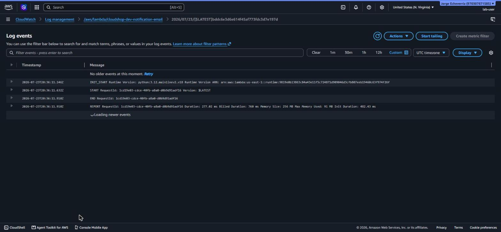
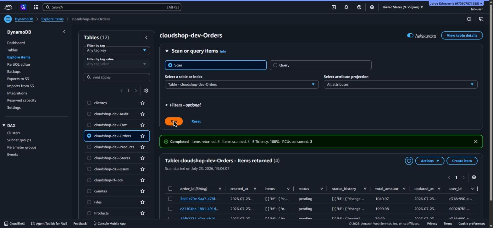
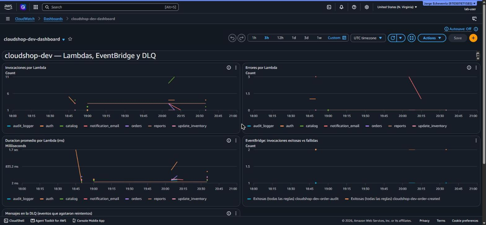
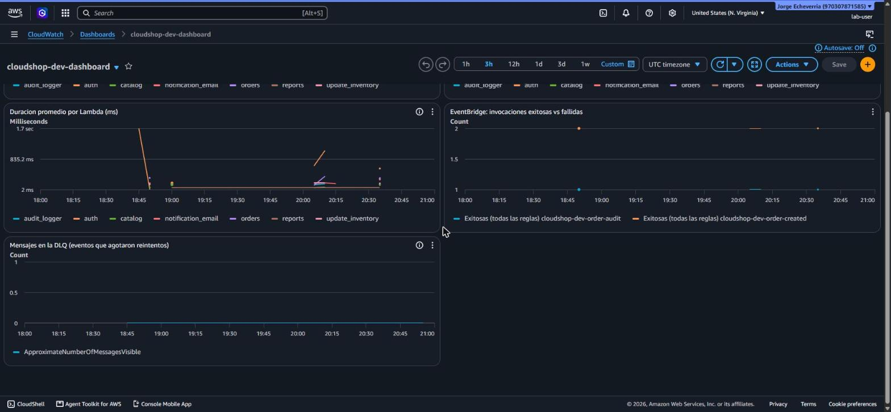
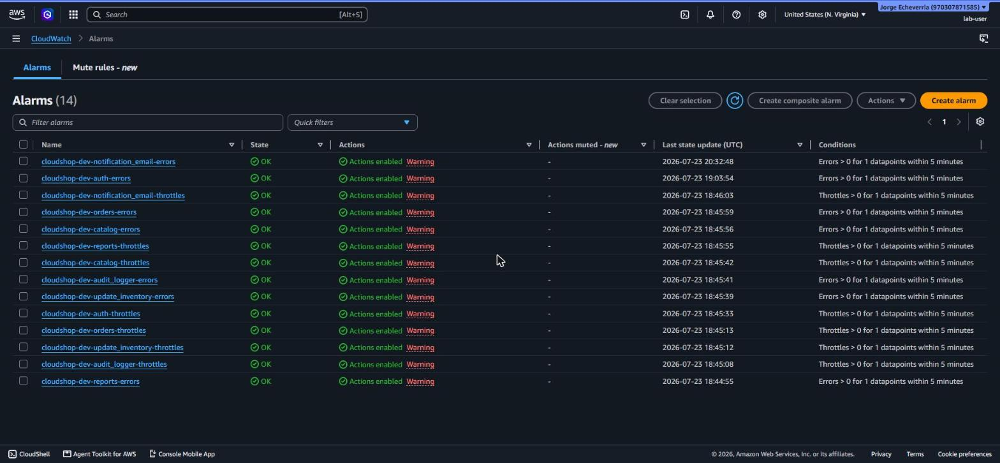

## Evidencias de los casos de prueba

### Caso 1 – Intento de acceso sin permisos (403 Forbidden)

Se realizó una petición `GET /v1/products` con la API Key correcta pero **sin el token JWT de Cognito**. El API Gateway respondió con `403 Forbidden`, demostrando que la autenticación está correctamente configurada.


---

### Caso 2 – Pedido completo con inventario, auditoría y correo

Se ejecutó el flujo completo contra la API real: registro, login, consulta de catálogo, carrito y creación de un pedido. El evento `OrderCreated` disparó las 3 Lambdas async (`update_inventory`, `audit_logger`, `notification_email`), confirmadas en CloudWatch Logs y en la tabla `Orders` de DynamoDB. Durante la prueba se encontró y corrigió un bug real de IAM: la policy de `notification_email` solo cubría la identidad SES del remitente, pero en modo sandbox AWS exige permiso también sobre la identidad del destinatario — se amplió la policy y se confirmó el envío exitoso.




---

### Caso 3 – Métricas en CloudWatch

Se capturaron las métricas reales del dashboard `cloudshop-dev-dashboard` (invocaciones y errores por Lambda, duración, EventBridge, DLQ) y las 14 alarmas de CloudWatch, todas en estado `OK`. La alarma de `notification_email` se ve pasar por `ALARM` durante el incidente del Caso 2 y volver a `OK` tras el fix, confirmando que el monitoreo detecta incidentes reales.





---

### Caso 4 – Despliegue completo mediante Terraform

Se ejecutó `terraform apply` desde cero, creando todos los recursos definidos en el código (S3, CloudFront, WAF, API Gateway, IAM, Cognito). Terraform completó el despliegue exitosamente.`


---

## Despliegue

### Variables (`environments/dev/terraform.tfvars`)

Copia `environments/dev/terraform.tfvars.example` a `environments/dev/terraform.tfvars` y completa los valores reales (ver comentarios en el archivo).

### Entorno de desarrollo con Docker (opcional, recomendado)

El repo incluye un `Dockerfile`/`docker-compose.yml` con Terraform, AWS CLI y pytest preinstalados — evita tener que instalar nada localmente. Corre como usuario no-root y monta el repo + tus credenciales de AWS (solo lectura) dentro del contenedor.

**Construir la imagen:**
```
docker compose build
```

**Levantar una shell interactiva dentro del contenedor** (monta el repo en `/workspace`, credenciales en `~/.aws` read-only):
```
docker compose run --rm env
```
Desde ahí corres los comandos normales de Terraform/AWS CLI del resto de este README (`cd environments/dev && terraform init`, etc.) como si estuvieras en tu máquina, pero con el entorno ya listo.

**O correr un comando puntual sin entrar a una shell**, por ejemplo los tests:
```
docker compose run --rm env pytest tests/ -q
```
o validar el Terraform sin aplicar nada:
```
docker compose run --rm env bash -c "cd environments/dev && terraform init && terraform validate"
```

Requisitos: Docker Desktop corriendo, y `~/.aws/credentials` configurado en tu máquina host (el contenedor lo monta, no lo genera). El contenedor **no** hace `terraform apply` por sí solo — sigue siendo un paso manual que corres tú dentro (o fuera) del contenedor.

### Backend remoto (una sola vez, antes del primer `apply` de `environments/dev`)

```
cd environments/backend-bootstrap
terraform init
terraform apply
```

Crea el bucket S3 (state) y la tabla DynamoDB (lock) que usa `environments/dev/backend.tf`. Solo se corre una vez por cuenta/equipo, no en cada deploy.

### Stack principal

```
cd environments/dev
terraform init
terraform plan -out=tfplan.out
terraform apply tfplan.out
```

El frontend (carpeta `frontend/`) se sube automáticamente al bucket S3 como parte de este mismo `apply` (un recurso `aws_s3_object` por archivo, en `environments/dev/main.tf`) — no hace falta ningún `aws s3 sync` manual.

### Despues del apply: conectar el frontend a la API real

`frontend/config.js` trae valores de ejemplo. Despues del primer `apply`, actualiza ese archivo con los valores reales:

```
terraform output api_url            # -> API_BASE_URL
terraform output api_key_value      # -> API_KEY (opcional, ver comentario en config.js)
```

Como `config.js` es uno de los archivos que sube `aws_s3_object`, despues de editarlo hay que volver a correr `terraform apply` (o subirlo a mano con `aws s3 cp frontend/config.js s3://<bucket>/config.js`) para que el bucket refleje el cambio. La URL publica del sitio es el dominio de CloudFront: `terraform output cloudfront_domain_name`.